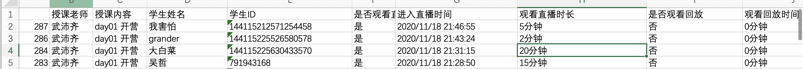
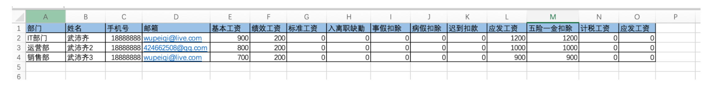
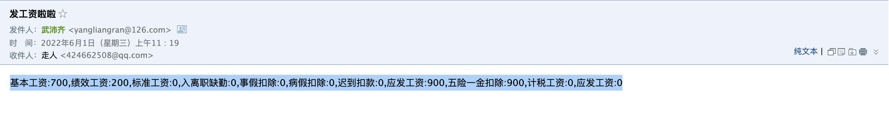
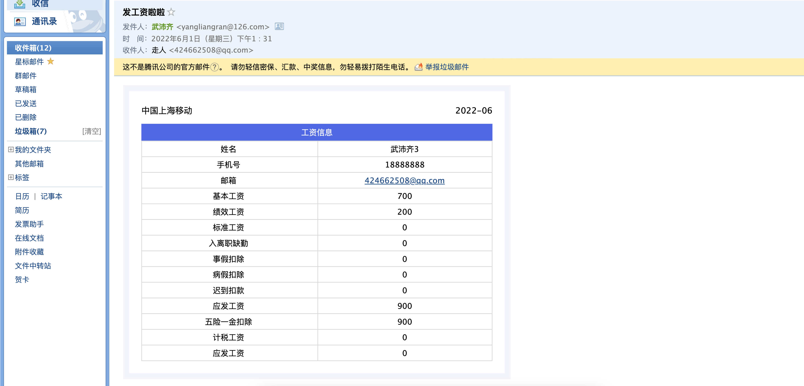
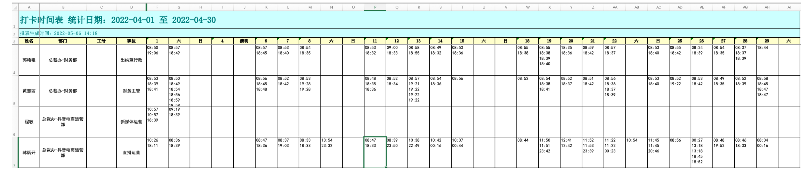
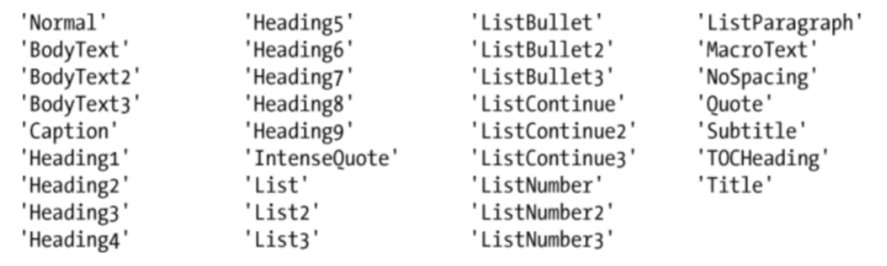
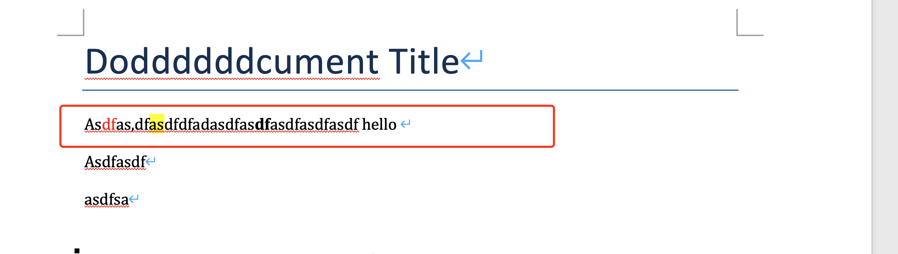

# day04 办公自动化

  

## 1.内容回顾

  

-   环境搭建：解释器 + 语法

-   系统解释器相关的路径 
    ```python
    C:\Python39
        python.exe
        Lib
        Scripts
        	pip.exe
    ```
     
    ```python
    python.exe  xxx/xxx/xxx.py
    ```
    

-   虚拟环境的概念（有了多个环境，安装的包） 
    ```python
    C:\Python39
        python.exe
        Lib
        	- site-pakages
        Scripts
        	pip.exe
    ```
     
    ```
    - 创建项目：文件夹
    - 虚拟一个python解释器（又安装Python）
    
    D:\code\s2day04
    	.venv
    		- python.exe
    		- Lib
    			- site-pakages
    		- Scrpts
    			- pip.exe
    	demo.py 
    	demo.py
    
    需要安装django ,  pip install django==1.8  , import django
    
    
    D:\code\s2day05
    	venv
    		- python.exe
    		- Lib
    			- site-pakages
    				- django==3.2
    		- Scrpts
    			- pip.exe
    	demo.py
    需要安装django ,  pip install django==3.2  , import django
    
    
    D:\code\s2day06
    	venv
    		- python.exe
    		- Lib
    		- Scrpts
    			- pip.exe
    	demo.py
    ```
    

-   语法

-   变量

-   输入输出

-   注释

-   条件、循环

-   数据类型

-   字典

-   字符串

-   列表

-   函数

-   定义

-   参数

-   返回值

-   模块

-   自定义

-   第三方

-   内置模块：os/time/datetime/random

  

## 2.excel相关操作

  

```
pip install openpyxl
```

  

### 2.1 读取

  

-   打开Excel 
    ```python
    from openpyxl import load_workbook
    
    # WorkBook对象 -> Excel文件
    wb = load_workbook("files/打卡.xlsx")  # 文件路径
    
    # 平时开发都是用路径。
    ```
     
    ```python
    from openpyxl import load_workbook
    
    
    f = open("files/打卡.xlsx",mode='rb')
    
    # WorkBook对象 -> Excel文件
    wb = load_workbook(f) # 文件对象
    
    f.close()
    
    # 写个网站，别人上传Excel，打开Excel
    ```
    

-   读取sheet 
    ```python
    from openpyxl import load_workbook
    
    wb = load_workbook("files/打卡.xlsx")
    
    # ####### 方式1 ###########
    # 1.1 获取所有sheet名称
    v1 = wb.sheetnames
    print(v1)  # ["北京","广州","上海","厦门"]
    
    # 1.2 根据sheet名称获取对象
    sheet = wb["北京"]
    
    # 1.3 获取单元格的数据
    cell = sheet.cell(1,1)
    print(cell.value)
    
    # ####### 方式2 ###########
    # 2.1 获取sheet对象列表
    v1 = wb.worksheets
    print(v1)  # [sheet对象,sheet对象,sheet对象,sheet对象,]
    
    # 2.2 获取某一个sheet
    sheet = wb.worksheets[2]
    
    # 2.3 获取单元格的数据
    cell = sheet.cell(1,1)
    print(cell.value)
    ```
    

-   读取单元格 
    ```python
    from openpyxl import load_workbook
    
    wb = load_workbook("files/打卡.xlsx")
    sheet = wb.worksheets[0]
    
    # 读取指定单元格
    cell = sheet.cell(1,2)
    print(cell.value)
    
    cell = sheet["B5"]
    print(cell.value)
    ```
     
    ```python
    from openpyxl import load_workbook
    
    wb = load_workbook("files/打卡.xlsx")
    sheet = wb.worksheets[0]
    
    # 读取第3行 [单元格,单元格,单元格,单元格,单元格,单元格,]
    cell_list = sheet[3]
    
    cell_list[0]
    cell_list[2]
    
    for cell in cell_list:
        print(cell.value)
    ```
     
    ```python
    from openpyxl import load_workbook
    
    wb = load_workbook("files/打卡.xlsx")
    sheet = wb.worksheets[0]
    
    # 读取所有行
    for row in sheet.rows:
        # row = [单元格对象,单元格,单元格,单元格,单元格,]
    	print(row[1].value)
        
    # 读取所有行
    for row in sheet.rows:
        # row = [单元格对象,单元格对象,单元格对象,单元格对象,单元格对象,]
    	row_text_list = []
        for cell in row:
            row_text_list.append(cell.value)
    	print(row_text_list) # ["文本","文本","文本"]
    ```
     
    ```python
    from openpyxl import load_workbook
    
    wb = load_workbook("files/打卡.xlsx")
    sheet = wb.worksheets[0]
    
    # 读取某些行
    for row in sheet.iter_rows(min_row=2):
        # row = [单元格对象,单元格对象,单元格对象,单元格对象,单元格对象,]
    	print(row[1].value)
        
    # 读取某些行
    for row in sheet.iter_rows(min_row=2,max_row=10):
        # row = [单元格对象,单元格对象,单元格对象,单元格对象,单元格对象,]
    	print(row[1].value)
    ```
    

  

### 案例

  

-   读取公开课信息  
     
    ```python
    如何切出来20/5等数字？
    
    #     -4 -3 -2 -1
    #       0123
    text = "15分钟"
    
    根据索引取某一个字符
        text[2] #"分"
        text[1] #"0"
        text[-1] # "钟"
        text[-2] # "分"
    切片获取多个字符（前取后不取）
    	text[0:2] # "20"
    	text[1:3] # "0分"
    	text[:-1] # "20分"
    	text[:-2] # "20"
    ```
     
    ```python
    v1 = "5分钟"
    num = v1[:-2]
    
    v2 = "1000分钟"
    num = v2[:-2]
    ```
     
    ```python
    import os
    from openpyxl import load_workbook
    
    base_dir = os.path.dirname(os.path.abspath(__file__))
    file_path = os.path.join(base_dir, 'files', "腾讯课堂.xlsx")
    
    wb = load_workbook(file_path)
    sheet = wb.worksheets[0]
    
    for row in sheet.iter_rows(min_row=2):
        # row=[单元格,单元格,单元格]
        name = row[3].value
        date_string = row[7].value[:-2]
        date_int = int(date_string)
        print(name, date_int)
    ```
    

-   读取公开课信息 + 观看时长 > 50分钟人数 
    ```python
    import os
    from openpyxl import load_workbook
    
    base_dir = os.path.dirname(os.path.abspath(__file__))
    file_path = os.path.join(base_dir, 'files', "腾讯课堂.xlsx")
    
    wb = load_workbook(file_path)
    sheet = wb.worksheets[0]
    
    count = 0
    for row in sheet.iter_rows(min_row=2):
        # row=[单元格,单元格,单元格]
        name = row[3].value
        date_string = row[7].value[:-2]
        date_int = int(date_string)
        if date_int > 50:
            # count = count + 1
            count += 1
            
    print(count)
    ```
    

-   工资条，读取Excel工资信息 + 发送邮件（简易）  
      
     
    ```python
    import os
    from openpyxl import load_workbook
    
    
    # 定义函数
    def send_email(to, subject, content):
        # 1.将Python内置的模块（功能导入）
        import smtplib
        from email.mime.text import MIMEText
        from email.utils import formataddr
    
        # 2.构建邮件内容
        msg = MIMEText(content, "html", "utf-8")  # 内容
        msg["From"] = formataddr(["武沛齐", "yangliangran@126.com"])  # 自己名字/自己邮箱
        msg['to'] = to  # 目标邮箱
        msg['Subject'] = subject  # 主题
    
        # 3.发送邮件
        server = smtplib.SMTP_SSL("smtp.126.com")
        server.login("yangliangran@126.com", "LAYEVIAPWQAVVDEP")  # 账户/授权码
        # 自己邮箱、目标邮箱
        server.sendmail("yangliangran@126.com", to, msg.as_string())
        server.quit()
    
    
    base_dir = os.path.dirname(os.path.abspath(__file__))
    file_path = os.path.join(base_dir, 'files', "工资单.xlsx")
    
    wb = load_workbook(file_path)
    sheet = wb.worksheets[0]
    
    header_list = ["基本工资", "绩效工资", "标准工资", "入离职缺勤", "事假扣除", "病假扣除", "迟到扣款", "应发工资", "五险一金扣除", "计税工资", "应发工资"]
    
    for row in sheet.iter_rows(min_row=2):
        # row = [单元格,单元格,...]
        email = row[3].value
        cell_list = row[4:]
    
        text_list = []
        index = 0
        for cell in cell_list:
            head = header_list[index]
            value = cell.value
            index += 1
            ele = "{}:{}".format(head, value)
            text_list.append(ele)
    
        text_string = ",".join(text_list)
        # print(email, text_string)
    
        # 发送邮件
        send_email(email, "发工资啦啦", text_string)
    ```
    

-   美化邮件内容  
    

-   字符串类型 
    ```python
    v1 = "武沛齐"
    v2 = 'root'
    v3 = """阿斯蒂芬
    阿斯顿发
    阿斯蒂芬"""
    ```
    

-   HTML标签 + CSS样式 
    ```
    body = """
    <h1>中国移动</h1>
    <h3 style="color:red;">上海移动</h3>
    """
    ```
      
    如果想要写的更加专业，就需要专门学习前端开发。 
    ```
    https://www.bilibili.com/video/BV1rT4y1v7uQ?spm_id_from=333.999.0.0
    ```
     
    ```python
    # 定义函数
    def send_email(to, subject, content):
        # 1.将Python内置的模块（功能导入）
        import smtplib
        from email.mime.text import MIMEText
        from email.utils import formataddr
    
        # 2.构建邮件内容
        msg = MIMEText(content, "html", "utf-8")  # 内容
        msg["From"] = formataddr(["武沛齐", "yangliangran@126.com"])  # 自己名字/自己邮箱
        msg['to'] = to  # 目标邮箱
        msg['Subject'] = subject  # 主题
    
        # 3.发送邮件
        server = smtplib.SMTP_SSL("smtp.126.com")
        server.login("yangliangran@126.com", "LAYEVIAPWQAVVDEP")  # 账户/授权码
        # 自己邮箱、目标邮箱
        server.sendmail("yangliangran@126.com", to, msg.as_string())
        server.quit()
    
    
    body = """
    <div style="width:580px;border:10px solid #F6F6Fc;padding:20px;">
        
        <div style="display: flex;justify-content: space-between;">
            <div>中国上海移动</div>
            <div>2022-06</div>
        </div>
        
        <div style="color:#FFFFFF;background: #5D6FED;text-align:center;font-size: 13px;line-height:28px;margin-top:10px;">
            工资信息
        </div>
        
        <div style="border-right:1px solid #DADADA;border-top:1px solid #DADADA;">
            
            <div style="font-size: 13px;height: 25px;line-height:25px;border-bottom:1px solid #DADADA;">
                <div style="width:286px;display:inline-block;border-left:1px solid #DADADA;text-align:center">
                    姓名
                </div>
                <div style="width:286px;display:inline-block;border-left:1px solid #DADADA;text-align:center">
                    武沛齐
                </div>
            </div>
            
            
            
            <div style="font-size: 13px;height: 25px;line-height:25px;border-bottom:1px solid #DADADA;">
                <div style="width:286px;display:inline-block;border-left:1px solid #DADADA;text-align:center">
                    基本工资
                </div>
                <div style="width:286px;display:inline-block;border-left:1px solid #DADADA;text-align:center">
                    10000
                </div>
            </div>
            
            
        </div>
    </div>
    """
    
    send_email("424662508@qq.com", "发工资啦", body)
    ```
    

-   发送工资条+ 美化  
     
    ```python
    import os
    from openpyxl import load_workbook
    
    
    # 定义函数
    def send_email(to, subject, content):
        # 1.将Python内置的模块（功能导入）
        import smtplib
        from email.mime.text import MIMEText
        from email.utils import formataddr
    
        # 2.构建邮件内容
        msg = MIMEText(content, "html", "utf-8")  # 内容
        msg["From"] = formataddr(["武沛齐", "yangliangran@126.com"])  # 自己名字/自己邮箱
        msg['to'] = to  # 目标邮箱
        msg['Subject'] = subject  # 主题
    
        # 3.发送邮件
        server = smtplib.SMTP_SSL("smtp.126.com")
        server.login("yangliangran@126.com", "LAYEVIAPWQAVVDEP")  # 账户/授权码
        # 自己邮箱、目标邮箱
        server.sendmail("yangliangran@126.com", to, msg.as_string())
        server.quit()
    
    
    base_dir = os.path.dirname(os.path.abspath(__file__))
    file_path = os.path.join(base_dir, 'files', "工资单.xlsx")
    
    wb = load_workbook(file_path)
    sheet = wb.worksheets[0]
    
    # header_list = ["基本工资", "绩效工资", "标准工资", "入离职缺勤", "事假扣除", "病假扣除", "迟到扣款", "应发工资", "五险一金扣除", "计税工资", "应发工资"]
    header_list = []
    first_row = sheet[1]
    
    for cell in first_row[1:]:
        header_list.append(cell.value)
    
    for row in sheet.iter_rows(min_row=2):
        # row = [单元格,单元格,...]
        email = row[3].value
        cell_list = row[1:]
    
        text_list = []
        index = 0
        for cell in cell_list:
            head = header_list[index]
            value = cell.value
            index += 1
            ele = """
            <div style="font-size: 13px;height: 25px;line-height:25px;border-bottom:1px solid #DADADA;">
                <div style="width:286px;display:inline-block;border-left:1px solid #DADADA;text-align:center">
                    {}
                </div>
                <div style="width:286px;display:inline-block;border-left:1px solid #DADADA;text-align:center">
                    {}
                </div>
            </div>
            """.format(head, value)
            text_list.append(ele)
    
        text_string = "".join(text_list)
    
        body = """
        <div style="width:580px;border:10px solid #F6F6Fc;padding:20px;">
            <div style="display: flex;justify-content: space-between;">
                <div>中国上海移动</div>
                <div>2022-06</div>
            </div>
            <div style="color:#FFFFFF;background: #5D6FED;text-align:center;font-size: 13px;line-height:28px;margin-top:10px;">
                工资信息
            </div>
            <div style="border-right:1px solid #DADADA;border-top:1px solid #DADADA;">
                {}
            </div>
        </div>
        """.format(text_string)
        # 发送邮件
        send_email(email, "发工资啦啦", body)
    ```
     
    ```python
    import os
    from openpyxl import load_workbook
    
    
    # 定义函数
    def send_email(to, subject, content):
        # 1.将Python内置的模块（功能导入）
        import smtplib
        from email.mime.text import MIMEText
        from email.utils import formataddr
    
        # 2.构建邮件内容
        msg = MIMEText(content, "html", "utf-8")  # 内容
        msg["From"] = formataddr(["武沛齐", "yangliangran@126.com"])  # 自己名字/自己邮箱
        msg['to'] = to  # 目标邮箱
        msg['Subject'] = subject  # 主题
    
        # 3.发送邮件
        server = smtplib.SMTP_SSL("smtp.126.com")
        server.login("yangliangran@126.com", "LAYEVIAPWQAVVDEP")  # 账户/授权码
        # 自己邮箱、目标邮箱
        server.sendmail("yangliangran@126.com", to, msg.as_string())
        server.quit()
    
    
    base_dir = os.path.dirname(os.path.abspath(__file__))
    file_path = os.path.join(base_dir, 'files', "工资单.xlsx")
    
    wb = load_workbook(file_path)
    sheet = wb.worksheets[0]
    
    # header_list = ["基本工资", "绩效工资", "标准工资", "入离职缺勤", "事假扣除", "病假扣除", "迟到扣款", "应发工资", "五险一金扣除", "计税工资", "应发工资"]
    header_list = []
    first_row = sheet[1]
    
    for cell in first_row[1:]:
        header_list.append(cell.value)
    
    for row in sheet.iter_rows(min_row=2):
        # row = [单元格,单元格,...]
        email = row[3].value
        cell_list = row[1:]
    
        text_list = []
        index = 0
        for cell in cell_list:
            head = header_list[index]
            value = cell.value
            index += 1
            ele = """
             <div style="font-size: 13px;height: 25px;line-height:25px;border-bottom:1px solid #DADADA;">
                <div style="width:50%;float:left;text-align:center">
                    {}
                </div>
                <div style="width:50%;float:left;text-align:center">
                    {}
                </div>
                <div style="clear:both;"></div>
            </div>
            """.format(head, value)
            text_list.append(ele)
    
        text_string = "".join(text_list)
    
        body = """
        <div style="width:580px;border:10px solid #F6F6Fc;padding:20px;">
            <div style="display: flex;justify-content: space-between;">
                <div>中国上海移动</div>
                <div>2022-06</div>
            </div>
            <div style="color:#FFFFFF;background: #5D6FED;text-align:center;font-size: 13px;line-height:28px;margin-top:10px;">
                工资信息
            </div>
            <div style="border:1px solid #DADADA;">
                {}
            </div>
        </div>
        """.format(text_string)
        # 发送邮件
        send_email(email, "发工资啦啦", body)
    ```
    

-   钉钉打卡信息  
     
    ```python
    text = "09:00\n18:03\n19:00\n20:00"
    
    item_list = text.split("\n") # [09:00,...20:00]
    
    start_str = item_list[0]
    end_str = item_list[-1]
    ```
     
    ```python
    from datetime import timedelta
    
    start_str = "12:13"
    end_str = "23:00"
    
    start_time = timedelta(hours=int(start_str.split(":")[0]), minutes=int(start_str.split(":")[1]))
    end_time = timedelta(hours=int(end_str.split(":")[0]), minutes=int(end_str.split(":")[1]))
    interval = end_time - start_time
    if interval.seconds >= 28800:
        print("大于8小时")
    else:
        print("小于8小时")
    ```
     
    ```python
    from datetime import timedelta
    
    text = "09:13\n18:03\n19:00\n20:00"
    
    item_list = text.split("\n")  # [09:00,...20:00]
    start_str = item_list[0]  # "09：13"
    end_str = item_list[-1]  # "20:00"
    start_time = timedelta(hours=int(start_str.split(":")[0]), minutes=int(start_str.split(":")[1]))
    end_time = timedelta(hours=int(end_str.split(":")[0]), minutes=int(end_str.split(":")[1]))
    interval = end_time - start_time
    if interval.seconds >= 28800:
        print("大于8小时")
    else:
        print("小于8小时")
    ```
     
    ```python
    import os
    from datetime import timedelta
    from openpyxl import load_workbook
    
    base_dir = os.path.dirname(os.path.abspath(__file__))
    file_path = os.path.join(base_dir, 'files', "钉钉.xlsx")
    
    wb = load_workbook(file_path)
    sheet = wb.worksheets[0]
    
    for row in sheet.iter_rows(min_row=4):
        username = row[0].value
    
        row_text_list = []
        for cell in row[5:]:
            if cell.value == None:
                row_text_list.append("异常")
                continue
    
            item_list = cell.value.split("\n")
            if len(item_list) < 2:
                row_text_list.append("异常")
                continue
    
            start_str = item_list[0].strip()
            end_str = item_list[-1].strip()
            start_time = timedelta(hours=int(start_str.split(":")[0]), minutes=int(start_str.split(":")[1]))
            end_time = timedelta(hours=int(end_str.split(":")[0]), minutes=int(end_str.split(":")[1]))
            interval = end_time - start_time
            if interval.seconds >= 28800:
                row_text_list.append("正常打卡")
            else:
                row_text_list.append("异常")
    
        print(username, row_text_list)
    ```
     
    ```python
    import os
    from datetime import timedelta
    from openpyxl import load_workbook
    
    base_dir = os.path.dirname(os.path.abspath(__file__))
    file_path = os.path.join(base_dir, 'files', "钉钉.xlsx")
    
    wb = load_workbook(file_path)
    sheet = wb.worksheets[0]
    
    for row in sheet.iter_rows(min_row=4):
        username = row[0].value
    
        row_text_list = []
        for cell in row[5:]:
            if cell.value == None:
                row_text_list.append("异常")
                continue
    
            item_list = cell.value.split("\n")
            if len(item_list) < 2:
                row_text_list.append("异常")
                continue
    
            start_str = item_list[0].strip()
            end_str = item_list[-1].strip()
            start_time = timedelta(hours=int(start_str.split(":")[0]), minutes=int(start_str.split(":")[1]))
            end_time = timedelta(hours=int(end_str.split(":")[0]), minutes=int(end_str.split(":")[1]))
            interval = end_time - start_time
            if interval.seconds >= 28800:
                row_text_list.append("正常打卡")
            else:
                row_text_list.append("异常")
    
        normal_date_list = []
    
        index = 1
        for text in row_text_list:
            if text == "正常打卡":
                normal_date_list.append("6-{}".format(index))
            index += 1
        print(username, normal_date_list)
    ```
    

  

### 2.2 写入

  

-   打开Excel 
    ```python
    from openpyxl import load_workbook
    
    wb = load_workbook("files/new.xlsx")
    sheet = wb.worksheets[0]
    
    cell = sheet.cell(1,2)
    cell.value = "xxxxx"
    
    wb.save("files/new.xlsx")
    ```
     
    ```python
    from openpyxl import workbook
    
    wb = workbook.Workbook()
    sheet = wb.worksheets[0]
    
    cell = sheet.cell(1,1)
    cell.value = "新的开始"
    
    wb.save("files/p2.xlsx")
    ```
    

-   内容操作 
    ```python
    from openpyxl import workbook
    from openpyxl.styles import Alignment, Border, Side, Font, PatternFill
    
    wb = workbook.Workbook()
    sheet = wb.worksheets[0]
    
    cell = sheet.cell(5, 5)
    
    # 1.设置文本
    cell.value = "新的开始"
    
    # 2.对齐方式
    # horizontal -> left  center  right
    # vertical -> top center bottom
    cell.alignment = Alignment(horizontal="center", vertical="center")
    
    # 3.边框
    cell.border = Border(
        top=Side(style="thin", color="000000"),
        bottom=Side(style="thin", color="000000"),
        left=Side(style="thin", color="000000"),
        right=Side(style="thin", color="000000"),
    )
    
    # 4.字体
    cell.font = Font(name="微软雅黑", size=45, color="6495ED")
    
    # 5.背景色
    cell.fill = PatternFill("solid", fgColor="FFD700")
    
    # 6.高度和宽度(行/列）
    sheet.row_dimensions[2].height = 100
    sheet.column_dimensions["C"].width = 50
    
    # 7.写公式
    # cell.value = "=B3*B4"
    
    wb.save("news.xlsx")
    ```
    

  

### 案例

  

-   实现用户注册

-   excel文件不存在，创建文件并写入内容。

-   excel文件存在，已打开的文件中写入内容（下一行写）。

```python
import os
from openpyxl import load_workbook
from openpyxl import workbook
from openpyxl.styles import Alignment, Border, Side, Font, PatternFill

border = Border(
    top=Side(style="thin", color="000000"),
    bottom=Side(style="thin", color="000000"),
    left=Side(style="thin", color="000000"),
    right=Side(style="thin", color="000000"),
)

username = input("用户名：")
password = input("密码：")

base_dir = os.path.dirname(os.path.abspath(__file__))
file_path = os.path.join(base_dir, 'files', 'account.xlsx')
if os.path.exists(file_path):
    wb = load_workbook(file_path)
    sheet = wb.worksheets[0]
    next_row_index = sheet.max_row + 1
else:
    wb = workbook.Workbook()
    sheet = wb.worksheets[0]

    head_list = ["姓名", "密码"]
    col_index = 1
    for text in head_list:
        c1 = sheet.cell(1, col_index)
        c1.value = text
        c1.fill = PatternFill("solid", fgColor="FFD700")
        c1.border = border
        col_index += 1

    next_row_index = 2

row_list = [username, password]
body_col_index = 1
for text in row_list:
    cell = sheet.cell(next_row_index, body_col_index)
    cell.value = text
    cell.border = border
    body_col_index += 1

wb.save(file_path)
```

  

## 3.word操作

  

.docx文件，本质上是一个压缩包。

  

```python
pip install python-docx
```

  

### 3.1 读取

  

```python
import docx

obj = docx.Document("doc-files/test.docx")

p1 = obj.paragraphs[0]
print(p1)
print(p1.text)

for p in obj.paragraphs:
    print(p.text)
```

  

```python
import docx

obj = docx.Document("doc-files/demo.docx")

for p in obj.paragraphs:
    print(p.style.name, p.text)
```

  



  

```
import docx

obj = docx.Document("doc-files/demo.docx")

p1 = obj.paragraphs[1]

print(p1.text)  # Asdfas,dfasdfdfadasdfasdfasdfasdfasdf

for item in p1.runs:
    print(item.text)
```

  



  

### 3.2 写

  

```
import docx

obj = docx.Document()

obj.add_paragraph(text="中国移动")
obj.add_paragraph(text="中国上海")

obj.save("news.docx")
```

  

```python
import docx

obj = docx.Document()

obj.add_paragraph(text="中国移动")

p2 = obj.add_paragraph(text="中国上海")
p2.add_run(text="移动")
p2.add_run(text="武沛齐")

obj.save("news.docx")
```

  


  

```python
import docx

obj = docx.Document()

obj.add_paragraph(text="中国移动", style="Heading 1")
obj.add_paragraph(text="上海分公司", style="Heading 3")

p2 = obj.add_paragraph(text="中国上海")
p2.add_run(text="移动")
p2.add_run(text="武沛齐")

obj.save("news.docx")
```

  

样式操作：

  

-   字体大小 
    ```python
    import docx
    from docx.shared import Pt
    
    obj = docx.Document()
    
    obj.add_paragraph(text="中国移动", style="Heading 1")
    
    p2 = obj.add_paragraph()
    
    r1 = p2.add_run(text="移动")
    r2 = p2.add_run(text="武沛齐")
    r2.font.size = Pt(20)
    
    obj.save("news.docx")
    ```
    

-   对齐方式 
    ```python
    import docx
    from docx.shared import Pt
    from docx.enum.text import WD_ALIGN_PARAGRAPH
    
    obj = docx.Document()
    
    p1 = obj.add_paragraph(text="中国移动", style="Title")
    p1.paragraph_format.alignment = WD_ALIGN_PARAGRAPH.CENTER
    # p1.paragraph_format.alignment = WD_ALIGN_PARAGRAPH.LEFT
    # p1.paragraph_format.alignment = WD_ALIGN_PARAGRAPH.RIGHT
    
    
    p2 = obj.add_paragraph()
    r1 = p2.add_run(text="移动")
    r2 = p2.add_run(text="武沛齐")
    r2.font.size = Pt(20)
    
    obj.save("news.docx")
    ```
    

-   字体颜色 
    ```python
    import docx
    from docx.shared import Pt, RGBColor
    from docx.enum.text import WD_ALIGN_PARAGRAPH
    
    obj = docx.Document()
    
    p1 = obj.add_paragraph(text="中国移动", style="Title")
    p1.paragraph_format.alignment = WD_ALIGN_PARAGRAPH.CENTER
    # p1.paragraph_format.alignment = WD_ALIGN_PARAGRAPH.LEFT
    # p1.paragraph_format.alignment = WD_ALIGN_PARAGRAPH.RIGHT
    
    
    p2 = obj.add_paragraph()
    r1 = p2.add_run(text="移动")
    r1.font.color.rgb = RGBColor(204, 0, 51)
    r1.bold = True
    
    r2 = p2.add_run(text="武沛齐")
    r2.font.size = Pt(20)
    
    obj.save("news.docx")
    ```
    

-   字体 
    ```python
    import docx
    from docx.shared import Pt, RGBColor
    from docx.enum.text import WD_ALIGN_PARAGRAPH
    
    obj = docx.Document()
    
    p1 = obj.add_paragraph(text="中国移动", style="Title")
    p1.paragraph_format.alignment = WD_ALIGN_PARAGRAPH.CENTER
    # p1.paragraph_format.alignment = WD_ALIGN_PARAGRAPH.LEFT
    # p1.paragraph_format.alignment = WD_ALIGN_PARAGRAPH.RIGHT
    
    
    p2 = obj.add_paragraph()
    r1 = p2.add_run(text="移动")
    r1.font.color.rgb = RGBColor(204, 0, 51)
    r1.bold = True
    
    r2 = p2.add_run(text="武沛齐")
    r2.font.name = "黑体"
    r2._element.rPr.rFonts.set(qn('w:eastAsia'), "黑体")
    
    obj.save("news.docx")
    ```
    

-   行间距 
    ```python
    import docx
    from docx.shared import Pt, RGBColor
    from docx.enum.text import WD_ALIGN_PARAGRAPH
    from docx.oxml.ns import qn
    
    obj = docx.Document()
    
    p1 = obj.add_paragraph(text="中国移动", style="Title")
    p1.paragraph_format.alignment = WD_ALIGN_PARAGRAPH.CENTER
    
    
    p2 = obj.add_paragraph(
        text="中国移动公司中国移动公司中国移动公司中国移动公司中国移动公司中国移动公司中国移动公司中国移动公司中国移动公司中国移动公司中国移动公司中国移动公司中国移动公司中国移动公司中国移动公司中国移动公司中国移动公司中国移动公司中国移动公司中国移动公司中国移动公司中国移动公司中国移动公司中国移动公司中国移动公司中国移动公司中国移动公司中国移动公司中国移动公司中国移动公司中国移动公司中国移动公司中国移动公司中国移动公司中国移动公司中国移动公司中国移动公司中国移动公司中国移动公司中国移动公司")
    p2.paragraph_format.line_spacing = 1.5
    
    obj.save("news.docx")
    ```
    

-   图片 
    ```python
    import docx
    from docx.shared import Pt, RGBColor, Cm
    from docx.enum.text import WD_ALIGN_PARAGRAPH
    from docx.oxml.ns import qn
    
    obj = docx.Document()
    
    p1 = obj.add_paragraph(text="中国移动", style="Title")
    p1.paragraph_format.alignment = WD_ALIGN_PARAGRAPH.CENTER
    
    # 图片区域
    pic_area = obj.add_paragraph()
    run = pic_area.add_run()
    run.add_picture("doc-files/tt.png", width=Cm(5))
    pic_area.paragraph_format.alignment = WD_ALIGN_PARAGRAPH.CENTER
    
    p2 = obj.add_paragraph(
        text="中国移动公司中国移动公司中国移动公司中国移动公司中国移动公司中国移动公司中国移动公司中国移动公司中国移动公司中国移动公司中国移动公司中国移动公司中国移动公司中国移动公司中国移动公司中国移动公司中国移动公司中国移动公司中国移动公司中国移动公司中国移动公司中国移动公司中国移动公司中国移动公司中国移动公司中国移动公司中国移动公司中国移动公司中国移动公司中国移动公司中国移动公司中国移动公司中国移动公司中国移动公司中国移动公司中国移动公司中国移动公司中国移动公司中国移动公司中国移动公司")
    p2.paragraph_format.line_spacing = 1.5
    
    obj.save("news.docx")
    ```
    

  

### 案例

  

-   批量生成审批报告 
    ```python
    from docx import Document
    from docx.enum.text import WD_PARAGRAPH_ALIGNMENT
    from docx.shared import Pt
    from docx.oxml.ns import qn
    from docx.shared import Inches
    from docx.shared import Cm
    from docx.enum.text import WD_ALIGN_PARAGRAPH
    from datetime import datetime
    import time
    
    # 客户名单
    company_list = ['客户张三', '客户李四']
    today = datetime.now().strftime("%Y年%m月%d日")
    
    for username in company_list:
        document = Document()
        document.styles['Normal'].font.name = u'宋体'  # 设置文档的基础字体
        document.styles['Normal'].element.rPr.rFonts.set(qn('w:eastAsia'), u'宋体')  # 设置文档的基础中文字体
        document.styles['Normal'].font.size = Pt(14)  # 设置文档字体为14磅
    
        # 插入图片
        pic_para = document.add_paragraph()
        run = pic_para.add_run()
        run.add_picture("doc-files/tt.png", width=Cm(2))
        pic_para.paragraph_format.alignment = WD_ALIGN_PARAGRAPH.CENTER
    
        # 建立第一个自然段
        p1 = document.add_paragraph()  # 初始化建立第一个自然段
        p1.alignment = WD_PARAGRAPH_ALIGNMENT.CENTER  # 对齐方式为居中，没有这句默认为左对齐
        run1 = p1.add_run('审批报告说明')
        run1.font.name = u'微软雅黑'  # 设置西文字体
        run1.element.rPr.rFonts.set(qn('w:eastAsia'), u'微软雅黑')  # 设置段中文字体
        run1.font.size = Pt(21)  # 设置字体大小为21磅
        run1.font.bold = True  # 设置加粗
    
        # 建立第二个自然段
        p2 = document.add_paragraph()  # 初始化建立第二个自然段
        run2 = p2.add_run('尊敬的{}:'.format(username))  # 这个是对客户称谓
        run2.font.name = u'仿宋_GB2312'  # 设置西文字体
        run2.element.rPr.rFonts.set(qn('w:eastAsia'), u'仿宋_GB2312')  # 设置段中文字体
        run2.font.size = Pt(16)  # 设置字体大小为16磅
        run2.font.bold = True  # 设置加粗
    
        # 建立第三个自然段
        p3 = document.add_paragraph()  # 初始化建立第三个自然段
        p3.paragraph_format.first_line_indent = p3.style.font.size * 2
        run3 = p3.add_run('非常感谢贵公司长期以来对我公司支持。我公司同意了该项目的审核批复，今后与贵公司的联络和业务跟进工作由我公司xx负责，请贵公司一如既往得给与合作和支持。谢谢')  # 内容
        run3.font.name = u'仿宋_GB2312'  # 设置西文字体
        run3.element.rPr.rFonts.set(qn('w:eastAsia'), u'仿宋_GB2312')  # 设置段中文字体
        run3.font.size = Pt(16)  # 设置字体大小为16磅
    
        # 建立第四个自然段
        p4 = document.add_paragraph()  # 初始化建立第四个自然段
        p4.alignment = WD_PARAGRAPH_ALIGNMENT.RIGHT  # 对齐方式为居中
        run4 = p4.add_run('联系人：小明 日期：{}'.format(today))  # 内容
        run4.font.name = u'仿宋_GB2312'  # 设置西文字体
        run4.element.rPr.rFonts.set(qn('w:eastAsia'), u'仿宋_GB2312')  # 设置段中文字体
        run4.font.size = Pt(16)  # 设置字体大小为16磅
        run4.font.bold = True  # 设置加粗
    
        document.save('{}-审批报告.docx'.format(username))
    ```
    

  

## 4.图像识别

  

-   调用大厂的API：腾讯、百度、阿里、中国移动（API其他部门）

-   搞算法 & 机器学习等。

  

[https://ai.baidu.com/](https://ai.baidu.com/)

  

```python
import requests
import base64

# client_id 为官网获取的AK， client_secret 为官网获取的SK
host = 'https://aip.baidubce.com/oauth/2.0/token?grant_type=client_credentials&client_id=PhGc5UK5e5UOkSqpNakZLpxL&client_secret=cS1OaU3GngGDdsZj2Fo7scd4j7S3M3Gw'
response = requests.get(host)
data_dict = response.json()
access_token = data_dict['access_token']

request_url = "https://aip.baidubce.com/rest/2.0/ocr/v1/idcard"
# 二进制方式打开图片文件
f = open('imgs/x.jpeg', 'rb')
img = base64.b64encode(f.read())
f.close()

params = {"id_card_side": "front", "image": img}
request_url = request_url + "?access_token=" + access_token
headers = {'content-type': 'application/x-www-form-urlencoded'}
response = requests.post(request_url, data=params, headers=headers)
for k, v in response.json()["words_result"].items():
    print(k, v)
```

  

```python
import requests
import base64

# client_id 为官网获取的AK， client_secret 为官网获取的SK
host = 'https://aip.baidubce.com/oauth/2.0/token?grant_type=client_credentials&client_id=PhGc5UK5e5UOkSqpNakZLpxL&client_secret=cS1OaU3GngGDdsZj2Fo7scd4j7S3M3Gw'
response = requests.get(host)
data_dict = response.json()
access_token = data_dict['access_token']

request_url = "https://aip.baidubce.com/rest/2.0/ocr/v1/doc_analysis_office"
# 二进制方式打开图片文件
f = open('imgs/1.jpeg', 'rb')
img = base64.b64encode(f.read())
f.close()

params = {"image": img}
request_url = request_url + "?access_token=" + access_token
headers = {'content-type': 'application/x-www-form-urlencoded'}
response = requests.post(request_url, data=params, headers=headers)
result_dict = response.json()
print(result_dict)

for item in result_dict['results']:
    print(item)
```