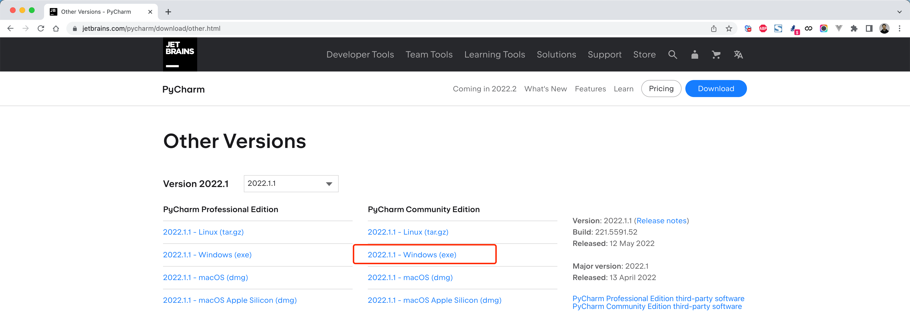
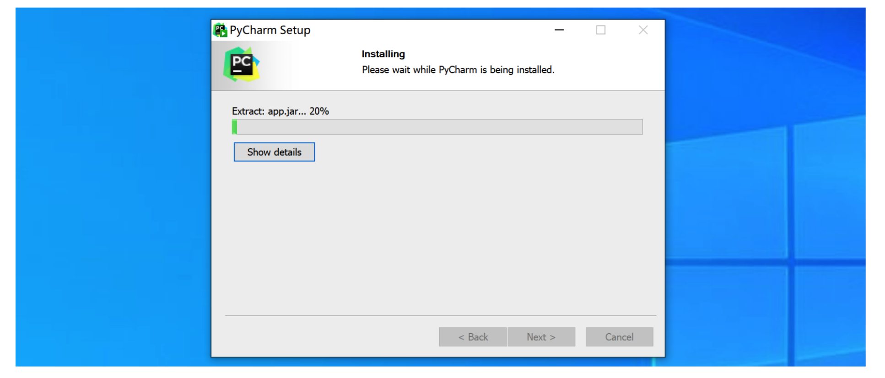
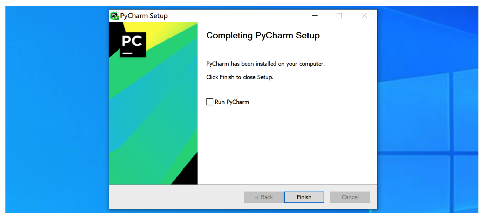

# 注意了注意了

  

由于Pycharm激活最近总出问题，为了保证正常的上课，大家在自己电脑上再安装一个【Pycharm社区版】，防止出现因Pycharm问题导致课程无法继续的问题。

  

Pycharm社区版下载和安装步骤如下：

  

## 第一步：下载社区版

  

[https://www.jetbrains.com/pycharm/download/other.html](https:_www.jetbrains.com_pycharm_download_other)

  

  

## 第二步：安装

  

  

  

  

## 第三步：创建项目

  

  

  

